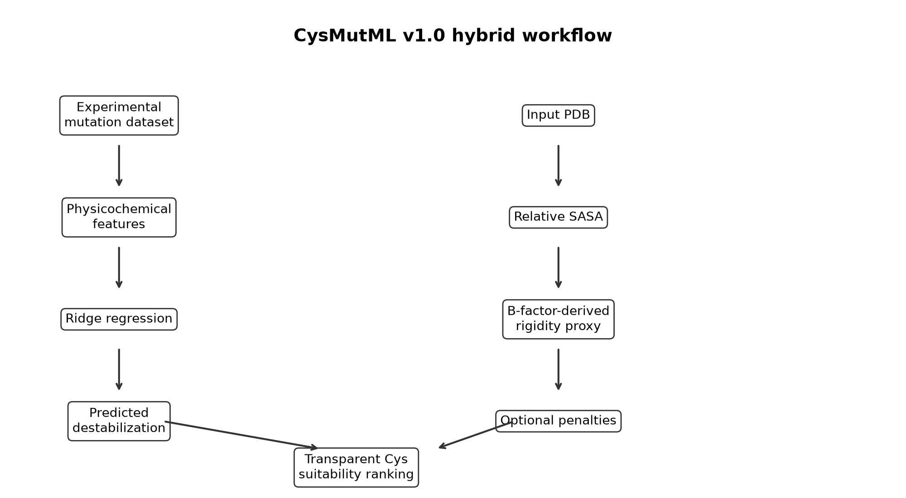

# CysMutML

[](https://github.com/jjimenezgar/CysMutML/actions/workflows/ci.yml)
[](https://www.python.org/)
[](LICENSE)

**CysMutML is a lightweight hybrid ML and structural-bioinformatics pipeline for prioritizing candidate cysteine substitutions in proteins.** It learns mutation-associated destabilization from FireProtDB using interpretable physicochemical features, then combines that prediction with target-PDB SASA, B-factor-derived flexibility, local exposed Lys context, protected-site, and existing-cysteine heuristics to produce a transparent Cys candidate ranking.



## Why This Project?

Cysteine substitutions are useful in protein engineering, labeling, immobilization, and conjugation, but a practical candidate should be both mutation-tolerant and structurally accessible. CysMutML demonstrates an end-to-end workflow for experimental data curation, leakage-safe ML validation, interpretable regression, structural bioinformatics, and transparent engineering prioritization.


## Portfolio Review Path

For a concise technical review, follow these artifacts in order:

1. [Portfolio notebook](notebooks/CysMutML_Portfolio_Demo.ipynb): grouped validation, task-specific metrics, interpretability, and a real PDB case.
2. [Model card](MODEL_CARD.md): intended use, evaluation design, limitations, and responsible interpretation.
3. [Model comparison](results/physchem_model_comparison/): fold-level Ridge, HGB, and Dummy results.
4. [Retrospective validation](validation/godoy2011/VALIDATION_REPORT.md): an honest audit against 13 published mutants.
5. [Core tests](tests/test_core.py): data, leakage, serialization, structural features, inference, and score reconstruction.

The CI workflow runs linting, tests, package build, and notebook execution from a clean checkout.

## Architecture

```text
FireProtDB
   |
   v
Physicochemical ML
   |
   v
Predicted destabilization
                         \
                          -> Cys ranking
                         /
Target PDB -> SASA + B-factor-derived rigidity + optional penalties
```

The ML model and the structural heuristic are intentionally separate.

## Key Capabilities

- Download and preprocess FireProtDB mutation-stability data.
- Aggregate repeated protein/mutation measurements by median DDG.
- Train/evaluate physicochemical models with protein-grouped cross-validation.
- Audit residual homology leakage with optional MMseqs2 sequence-clustered validation.
- Predict `predicted_destabilization_ddg` for every X->Cys mutation in a PDB chain.
- Rank candidates using transparent, configurable `cys_site_suitability`, `rigidification_potential`, and `final_engineering_score` formulas.
- Export ML predictions, ranking CSVs, a score-encoded PDB, and a PyMOL script.

## Model

Deployed v1.0 model:

```text
Ridge regression
```

Training dataset:

```text
FireProtDB v2.0 mutation-level median-aggregated dataset
352,005 rows
542 unique proteins
16,236 aggregated X->Cys rows
```

Target:

```text
destabilization_ddg_kcal_mol
larger positive values = greater destabilization
```

ML features:

```text
WT properties + mutant properties + mutant-minus-WT deltas + BLOSUM62
```

Structural descriptors are not used in the deployed ML model. They are applied only to the target PDB in the ranking stage.

## Actual Performance

Validation uses 3-fold `GroupKFold` by `protein_id`. A random mutation-level split is not used as the primary evaluation.

Overall grouped-CV metrics:

| Model | MAE | RMSE | R2 | Pearson | Spearman |
|---|---:|---:|---:|---:|---:|
| Dummy mean | 0.800 | 1.049 | -0.002 | undefined | undefined |
| Ridge | 0.684 | 0.930 | 0.213 | 0.462 | 0.450 |
| HistGradientBoosting | 0.669 | 0.917 | 0.234 | 0.485 | 0.475 |

X->Cys subset:

| Model | MAE | RMSE | R2 | Pearson | Spearman |
|---|---:|---:|---:|---:|---:|
| Dummy mean | 0.739 | 0.923 | -0.172 | undefined | undefined |
| Ridge | 0.587 | 0.803 | 0.115 | 0.348 | 0.345 |
| HistGradientBoosting | 0.579 | 0.795 | 0.131 | 0.364 | 0.362 |

HGB is slightly better, but Ridge remains deployed because it is close in performance, simpler, faster, and easier to interpret.

## Quick Start

Install:

```bash
python3 -m venv .venv
.venv/bin/pip install -e '.[dev]'
```

Run the real example:

```bash
cysmutml predict \
  --pdb examples/real_case/1csp.pdb \
  --chain A \
  --output examples/real_case
```

Reproduce data preparation:

```bash
cysmutml prepare-data --download-fireprotdb \
  --raw data/raw/fireprotdb.csv \
  --output data/processed/fireprotdb_mutations.csv

cysmutml audit-data \
  --processed data/processed/fireprotdb_mutations.csv \
  --raw data/raw/fireprotdb.csv

cysmutml build-features \
  --input data/processed/fireprotdb_mutations_aggregated.csv \
  --output data/processed/fireprotdb_aggregated_features.csv
```

## Outputs

`mutation_predictions.csv` contains the ML output:

- mutation identity;
- physicochemical features;
- predicted destabilization;
- `stability_component`.

`residue_ranking.csv` contains the engineering heuristic:

- relative SASA;
- accessibility component;
- B-factor-derived flexibility component;
- local exposed Lys component;
- optional penalties;
- `cys_site_suitability`;
- `rigidification_potential`;
- final `final_engineering_score`.

## Ranking Formula

Default formula:

```text
cys_site_suitability =
  0.60 * stability_component
+ 0.35 * accessibility_component
- 0.10 * existing_cys_penalty
- 0.15 * protected_site_penalty

rigidification_potential =
  0.35 * flexibility_component
+ 0.40 * lysine_environment_component
+ 0.25 * accessibility_component
- 0.05 * existing_cys_penalty
- 0.10 * protected_site_penalty

final_engineering_score =
  0.60 * cys_site_suitability
+ 0.40 * rigidification_potential
```

These are heuristic defaults, not experimentally optimized weights. Details are in `docs/RANKING_FORMULA.md`.

## Retrospective Validation: Godoy et al. 2011

CysMutML includes a small retrospective audit against the supplied Godoy et al. PGA/BTL2 cysteine-immobilization case study.

Files:

- `validation/godoy2011/VALIDATION_REPORT.md`
- `validation/godoy2011/full_validation_matrix.csv`
- `validation/godoy2011/validation_metrics_summary.csv`

Key result: the upgraded heuristic is more interpretable and partially enriches experimental sites in the upper 20-30% of candidates, but it is not calibrated enough to claim prediction of immobilization success. Combined rigidification potential had moderate association with stabilization factors across the 13 mutants, while per-enzyme correlations were weak or inconsistent.

## Real Example

The v1.0 case study uses PDB `1CSP` chain A and generated 67 X->Cys candidates.

Top 5:

| Rank | Mutation | Pred DDG | Stability | Rel SASA | Rigidity | Score |
|---:|---|---:|---:|---:|---:|---:|
| 1 | F38C | -1.040 | 1.000 | 0.562 | 0.832 | 0.835 |
| 2 | F27C | -1.040 | 1.000 | 0.166 | 0.985 | 0.747 |
| 3 | R56C | -0.201 | 0.734 | 0.758 | 0.712 | 0.737 |
| 4 | F30C | -1.040 | 1.000 | 0.242 | 0.815 | 0.735 |
| 5 | W8C | -1.169 | 1.000 | 0.342 | 0.585 | 0.720 |

See `examples/real_case/`.

## ML vs Heuristic

Learned from data:

- mutation-associated destabilization.

Calculated from structure:

- SASA;
- B-factor-derived flexibility proxy;
- local exposed Lys context;
- protected-site distance;
- existing-cysteine proximity.

Heuristic:

- normalization;
- penalties;
- final Cys suitability score.

CysMutML does not predict immobilization yield, activity retention, disulfide formation, or calibrated probability of success.

## Reproducibility

```bash
.venv/bin/pytest -q
.venv/bin/ruff check .
```

Latest verified status:

```text
pytest: 16 passed
ruff: all checks passed
```

## Documentation

- [`MODEL_CARD.md`](MODEL_CARD.md)
- [`notebooks/CysMutML_Portfolio_Demo.ipynb`](notebooks/CysMutML_Portfolio_Demo.ipynb)
- `docs/FEATURE_SCHEMA.md`
- `docs/RANKING_FORMULA.md`
- `docs/ML_VS_HEURISTIC.md`
- `docs/MODEL_STATUS_REPORT.md`
- `docs/SCIENTIFIC_AUDIT.md`
- `docs/INTERVIEW_GUIDE.md`
- [`docs/HOMOLOGY_VALIDATION.md`](docs/HOMOLOGY_VALIDATION.md)

## Limitations

- Stability is not immobilization success.
- Stability is not activity.
- B-factor is only a crystallographic rigidity proxy.
- SASA does not guarantee cysteine chemistry.
- Ranking weights are heuristic unless experimentally calibrated.
- FireProtDB measurements are heterogeneous across proteins, methods, temperature, and pH.
- Protein-grouped CV may still share homologous families across folds; v1.2 adds a stricter sequence-clustered comparison.
- This is not a state-of-the-art DDG predictor.

## Exploratory Work

The repository preserves an underpowered exploratory structure-trained ML ablation (`results/structural_ablation/`). It used 114 mapped rows and 6 X->Cys observations, did not improve performance in that small subset, and is not part of the v1.0 production pipeline.
